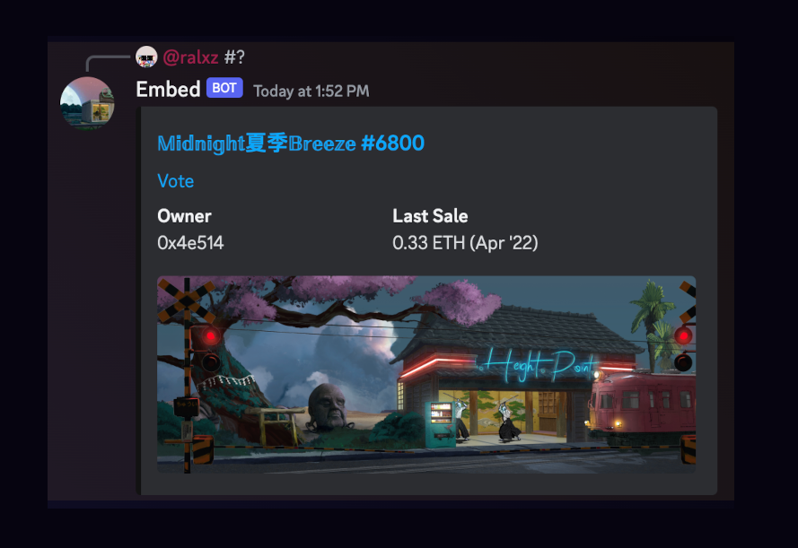

# discord-nft-embed-bot



A TypeScript [discord.js](https://discord.js.org/) bot that listens to messages in channels and replies with NFT items from a collection. Perfect for NFT communities wanting quick access to collection metadata.

## Features

- 🔍 **Message parsing** for `#1234`, `#random`, `#rand`, or `#?` syntax
- 👤 **Random by username** with `#username` or `prefix#username` syntax
- 📊 **Rich embeds** with NFT images and metadata (owner, last sale, listing, best offer)
- ⏰ **Scheduled random posts** to specified channels at intervals
- 🎯 **Multi-collection support** with custom prefix triggers
- 🛡️ **Type-safe** TypeScript implementation

## Table of Contents

- [Features](#features)
- [Prerequisites](#prerequisites)
- [Installation](#installation)
- [Configuration](#configuration)
- [Environment Variables](#environment-variables)
- [Multi-Collection Support](#multi-collection-support)
- [Usage](#usage)
- [Development](#development)
- [Testing](#testing)
- [Deployment](#deployment)
- [Troubleshooting](#troubleshooting)
- [Contributing](#contributing)

## Prerequisites

- Node.js 18+
- Yarn package manager
- OpenSea API key ([get one here](https://opensea.io/settings/developer))
- Discord bot token

## Installation

```bash
# Clone the repository
git clone https://github.com/ryanio/discord-nft-embed-bot.git
cd discord-nft-embed-bot

# Install dependencies
yarn install

# Build the project
yarn build
```

## Configuration

Create a `.env` file in the root directory with your configuration:

```env
# Required
COLLECTIONS=0xb6C2c2d2999c1b532E089a7ad4Cb7f8C91cf5075:GlyphBots:1:11111:ethereum:#00ff88
OPENSEA_API_TOKEN=your_opensea_api_key
DISCORD_TOKEN=your_discord_bot_token

# Optional - post random GlyphBot every 30 min to #🤖random-bots channel
RANDOM_INTERVALS=1234567890123456789=30
LOG_LEVEL=info
```

### GlyphBots + Artifacts Example

```env
# GlyphBots (default) + Artifacts (with "artifact" prefix)
COLLECTIONS=0xb6C2c2d2999c1b532E089a7ad4Cb7f8C91cf5075:GlyphBots:1:11111:ethereum:#00ff88,artifact:0x7136496aBFBAB3d17c34a3Cfc4CFbc68BfBCCbCc:GlyphBots Artifacts:1:11111:ethereum:#ff6b35
OPENSEA_API_TOKEN=your_opensea_api_key
DISCORD_TOKEN=your_discord_bot_token

# Post random bot OR artifact (rotating) to #🤖random-bots every 30 min
RANDOM_INTERVALS=1234567890123456789=30:*
```

With this config:
- `#42` → GlyphBots #42 (Vector the Kind, etc.)
- `#random` → Random GlyphBot
- `artifact#1` → GlyphBots Artifacts #1 (Vector the Kind: Quantum Infiltrator)
- `artifact#?` → Random Artifact

Originally developed for [@dutchtide](https://twitter.com/dutchtide)'s [𝕄𝕚𝕕𝕟𝕚𝕘𝕙𝕥 夏季 𝔹𝕣𝕖𝕖𝕫𝕖](https://opensea.io/collection/midnightbreeze) collection.

> 💡 **Tip**: To run multiple instances of this bot, check out [bot-runner](https://github.com/ryanio/bot-runner). Also see [opensea-activity-bot](https://github.com/ryanio/opensea-activity-bot) for activity notifications.

## Environment Variables

### Required Variables

| Variable | Description | Example |
|----------|-------------|---------|
| `COLLECTIONS` | Collection definitions (see format below) | `0x123...:GlyphBots:1:10000` |
| `OPENSEA_API_TOKEN` | Your OpenSea API key | Get from [OpenSea Account](https://opensea.io/settings/developer) |

### Discord Integration

| Variable | Description | Example |
|----------|-------------|---------|
| `DISCORD_TOKEN` | Discord bot token | Get from [Discord Developer Portal](https://discord.com/developers/applications) |

**Discord Setup:**
1. [Create a Discord application](https://discord.com/developers/applications)
2. Go to the **Bot** tab and click "Add Bot"
3. Under **Privileged Gateway Intents**, enable **Message Content Intent** (required to read message content)
4. Copy the bot token to `DISCORD_TOKEN`
5. **Invite bot to your server:**
   - Go to **OAuth2** → **URL Generator**
   - Under **Scopes**, select `bot`
   - Under **Bot Permissions**, select `Read Messages/View Channels`, `Send Messages`, and `Embed Links`
   - Copy the generated URL and open it in your browser
   - Select your server and authorize

**Quick Invite URL** (replace `YOUR_CLIENT_ID` with your application's Client ID from the OAuth2 page):
```
https://discord.com/oauth2/authorize?client_id=YOUR_CLIENT_ID&permissions=85056&scope=bot
```

### Optional Configuration

| Variable | Description | Default | Example |
|----------|-------------|---------|---------|
| `RANDOM_INTERVALS` | Channel IDs and intervals for random posts | - | `662377002338091020=5` |
| `LOG_LEVEL` | Log verbosity | `info` | `debug`, `info`, `warn`, `error` |
| `STATE_DIR` | Directory for state persistence | `.state` | `./data/state` |

**RANDOM_INTERVALS Format:**
- Single channel: `CHANNEL_ID=minutes` (rotates through all collections)
- Multiple channels: `CHANNEL_ID1=5,CHANNEL_ID2=10`
- Specific collection: `CHANNEL_ID=minutes:prefix`
- All collections (rotating): `CHANNEL_ID=minutes:*` (explicit, same as no option)
- Multiple collections (rotating): `CHANNEL_ID=minutes:prefix1+prefix2`

**Examples:**
```env
# Post random NFT every 30 min (rotates through all collections)
RANDOM_INTERVALS=123456789=30

# Post random Artifact every 15 min
RANDOM_INTERVALS=123456789=15:artifact

# Rotate between all collections every 20 min
RANDOM_INTERVALS=123456789=20:*

# Rotate between bots and artifacts every 30 min
RANDOM_INTERVALS=123456789=30:bot+artifact

# Multiple channels with different configs
RANDOM_INTERVALS=123456789=30,987654321=15:artifacts,111222333=20:*
```

### Legacy Environment Variables

For backward compatibility, the bot also supports individual environment variables for a single collection:

| Variable | Description | Example |
|----------|-------------|---------|
| `TOKEN_ADDRESS` | Contract address of the NFT collection | `0x1234...abcd` |
| `TOKEN_NAME` | Display name for the collection | `GlyphBots` |
| `MIN_TOKEN_ID` | Minimum token ID | `1` |
| `MAX_TOKEN_ID` | Maximum token ID | `10000` |
| `CHAIN` | Blockchain network | `ethereum` |
| `EMBED_COLOR` | Hex color for embeds | `#121212` |
| `CUSTOM_DESCRIPTION` | Custom description (`{id}` = token ID) | `View #{id}!` |

> **Note:** If `COLLECTIONS` is set, the legacy variables are ignored.

## Multi-Collection Support

The bot supports multiple NFT collections in a single `COLLECTIONS` environment variable. The **first collection** becomes the default (no prefix required), and **additional collections** use prefix triggers.

### Format

```env
COLLECTIONS=address:name:minId:maxId[:chain][:color][:imageUrl],prefix:address:name:minId:maxId[:chain][:color][:imageUrl]
```

**First collection (default):**
- `address` - Contract address
- `name` - Display name
- `minId` - Minimum token ID
- `maxId` - Maximum token ID (use `*` for dynamic supply from OpenSea)
- `chain` - Blockchain (optional, defaults to `ethereum`)
- `color` - Embed color hex (optional, defaults to `#121212`)
- `customDescription` - Custom description template (optional, `{id}` replaced with token ID, supports markdown links)
- `imageUrl` - Custom image URL template (optional, `{id}` replaced with token ID)

**Additional collections:**
- `prefix` - Trigger keyword (e.g., `artifacts`, `punk`)
- `address` - Contract address
- `name` - Display name
- `minId` - Minimum token ID
- `maxId` - Maximum token ID (use `*` for dynamic supply from OpenSea)
- `chain` - Blockchain (optional, defaults to `ethereum`)
- `color` - Embed color hex (optional, defaults to `#121212`)
- `customDescription` - Custom description template (optional, `{id}` replaced with token ID, supports markdown links)
- `imageUrl` - Custom image URL template (optional, `{id}` replaced with token ID)

### Example

```env
# Single collection (GlyphBots)
COLLECTIONS=0xb6C2c2d2999c1b532E089a7ad4Cb7f8C91cf5075:GlyphBots:1:11111:ethereum

# Multiple collections (GlyphBots default + Artifacts prefix)
COLLECTIONS=bot:0xb6C2c2d2999c1b532E089a7ad4Cb7f8C91cf5075:GlyphBots:1:11111:ethereum:#00ff88,artifacts:0x7136496aBFBAB3d17c34a3Cfc4CFbc68BfBCCbCc:GlyphBots Artifacts:1:11111:ethereum:#ff6b35t

# With dynamic supply (fetched from OpenSea)
COLLECTIONS=0x7136496aBFBAB3d17c34a3Cfc4CFbc68BfBCCbCc:GlyphBots Artifacts:1:*:ethereum

# With custom image URL (useful when Discord can't display SVGs)
COLLECTIONS=0xb6C2c2d2999c1b532E089a7ad4Cb7f8C91cf5075:GlyphBots:1:11111:ethereum:#00ff88:https://glyphbots.com/bots/pngs/{id}.png

# With custom description containing a markdown link
COLLECTIONS=0xb6C2c2d2999c1b532E089a7ad4Cb7f8C91cf5075:GlyphBots:1:11111:ethereum:#00ff88:[View Bot](https://glyphbots.com/bot/{id})

# With both custom description and image URL
COLLECTIONS=0xb6C2c2d2999c1b532E089a7ad4Cb7f8C91cf5075:GlyphBots:1:11111:ethereum:#00ff88:[View Bot](https://glyphbots.com/bot/{id}):https://glyphbots.com/bots/pngs/{id}.png
```

### Dynamic Supply

Use `*` as the `maxId` to automatically fetch the collection's total supply from OpenSea:

```env
# Total supply will be fetched from OpenSea on startup (ERC-721 only)
COLLECTIONS=0xb6C2c2d2999c1b532E089a7ad4Cb7f8C91cf5075:GlyphBots:1:*:ethereum
```

**How it works:**
1. On startup, the bot fetches the collection's `total_supply` from OpenSea and uses it as `maxTokenId`
2. Random token requests (`#random`, `#?`) use the fetched supply as the upper bound
3. Explicit token requests (e.g., `#12345`) will check OpenSea for new mints if they exceed the cached max
4. This handles ongoing mints automatically - users can request newly minted tokens without restarting the bot

**Benefits:**
- No need to manually update `maxId` when new tokens are minted
- Random requests always work within the actual supply range
- Explicit requests for new mints are handled gracefully

**⚠️ ERC-1155 Limitation:**
Dynamic supply (`*`) is **not supported for ERC-1155 collections**. OpenSea's `total_supply` for ERC-1155 represents the total number of editions (items × supply per item), not the number of unique token IDs. For ERC-1155 collections like GlyphBots Artifacts, you must specify an explicit `maxId`:

```env
# ERC-1155 collections require explicit maxId
COLLECTIONS=artifact:0x7136496aBFBAB3d17c34a3Cfc4CFbc68BfBCCbCc:GlyphBots Artifacts:1:150:ethereum
```

### Supported Message Syntax

| Syntax | Description |
|--------|-------------|
| `#1234` | Fetch GlyphBots #1234 |
| `#random` | Fetch a random GlyphBot |
| `#rand` | Fetch a random GlyphBot |
| `#?` | Fetch a random GlyphBot |
| `#username` | Fetch a random NFT from a user's collection |
| `artifact#1234` | Fetch GlyphBots Artifacts #1234 |
| `artifact#random` | Fetch a random Artifact |
| `artifact#?` | Fetch a random Artifact |
| `artifact#username` | Fetch a random Artifact from a user's collection |

### Random by Username

You can fetch a random NFT from an OpenSea user's collection using the `#username` syntax:

```
#codincowboy      → Random NFT from @codincowboy's collection (from default collection)
artifact#ralx_z  → Random Artifact from @ralx_z's collection
```

**How it works:**
1. Resolves the OpenSea username to a wallet address
2. Fetches NFTs owned by that address (optionally filtered by collection)
3. Picks a random NFT and displays it

**Username rules:**
- Must start with a letter (to distinguish from token IDs)
- 3-15 characters long
- Can contain letters, numbers, and underscores

### Provided Metadata Fields

- Owner
- Last sale (price and date)
- Listed for (current listing price)
- Best offer

## Usage

```bash
# Start the bot
yarn start

# Development mode (with hot reload)
yarn start:dev
```

## Development

### Setup Development Environment

```bash
# Install dependencies
yarn install

# Run in development mode
yarn start:dev

# Build the project
yarn build

# Format code
yarn format

# Lint code
yarn lint
```

### Project Structure

```
src/
├── index.ts              # Main entry point and Discord bot
├── api/
│   └── opensea.ts        # OpenSea API integration
├── config/
│   ├── collection.ts     # Collection configuration and parsing
│   └── constants.ts      # Application constants
├── lib/
│   ├── logger.ts         # Logging utilities
│   ├── lru-cache.ts      # Caching implementation
│   ├── types.ts          # TypeScript type definitions
│   └── utils.ts          # General utilities
└── state/
    └── state.ts          # Persistent state management
```

## State Persistence

The bot persists state to disk in a `.state` directory to survive restarts. State includes:

- **Recent tokens per channel**: Tracks recently sent random tokens to avoid duplicates
- **Custom state**: Extensible key-value storage for additional data

### State File Location

By default, state is stored in `.state/embed-bot-state.json`. You can customize this with the `STATE_DIR` environment variable.

### Duplicate Prevention

When using `RANDOM_INTERVALS`, the bot tracks the last 50 tokens sent to each channel and avoids sending duplicates. This ensures variety in random posts.

## Testing

```bash
# Run all tests
yarn test

# Run tests with coverage
yarn test:coverage

# Run tests in CI mode
yarn test:ci
```

The project uses Jest for testing with comprehensive coverage of:
- Message parsing and matching
- Collection configuration
- Embed generation
- OpenSea API integration
- State persistence
- Utility functions

## Deployment

### Recommended: DigitalOcean

I recommend DigitalOcean over Heroku for improved stability. Heroku servers can restart (cycle) which can lead to duplicate posts since the ephemeral disk is lost.

**DigitalOcean Setup ($5/month Basic Droplet):**

1. Create Ubuntu droplet
2. Install Node.js 22 and Yarn
3. Clone repository and install dependencies
4. Install PM2 for process management
5. Configure environment variables
6. Start with PM2

```bash
# Install PM2 globally
yarn global add pm2

# Start the bot
pm2 start yarn -- start

# Monitor the bot
pm2 list
pm2 logs

# Install log rotation
pm2 install pm2-logrotate

# Auto-start on reboot
pm2 startup
pm2 save
```

### Alternative: Docker

```dockerfile
FROM node:22-alpine
WORKDIR /app
COPY package.json yarn.lock ./
RUN yarn install --frozen-lockfile
COPY . .
RUN yarn build
CMD ["yarn", "start"]
```

### Environment Variables for Production

Set your environment variables in your deployment platform:

- **DigitalOcean**: Add to `/etc/profile` or use PM2 ecosystem file
- **Docker**: Use `-e` flags or `.env` file
- **Heroku**: Use `heroku config:set` commands

## Troubleshooting

### Common Issues

**Bot not posting messages:**
- Verify Discord bot has `Read Messages/View Channels`, `Send Messages`, and `Embed Links` permissions
- Check that bot is added to the specified channels
- Ensure `DISCORD_TOKEN` is correct
- Enable **Message Content Intent** on your bot page

**No embeds appearing:**
- Verify contract address in `COLLECTIONS` is correct
- Check `OPENSEA_API_TOKEN` is valid
- Ensure min/max token IDs are set correctly in `COLLECTIONS`

**Random intervals not working:**
- Check `RANDOM_INTERVALS` format: `CHANNEL_ID=minutes` or `CHANNEL_ID=minutes:prefix`
- Verify the bot has access to the specified channels

**Collection prefix not working:**
- Check `COLLECTIONS` format matches: `prefix:address:name:minId:maxId`
- Ensure prefix is lowercase in your messages
- Verify the contract address is correct

### Debug Mode

Enable debug logging to troubleshoot issues:

```bash
LOG_LEVEL=debug yarn start
```

### Logs

The bot provides structured logging with different levels:
- `debug`: Detailed information for debugging
- `info`: General information about bot activity
- `warn`: Warning messages for potential issues
- `error`: Error messages for failures

## Contributing

### Development Workflow

1. Fork the repository
2. Create a feature branch: `git checkout -b feature/amazing-feature`
3. Make your changes
4. Run tests: `yarn test`
5. Format code: `yarn format`
6. Commit changes: `git commit -m 'Add amazing feature'`
7. Push to branch: `git push origin feature/amazing-feature`
8. Open a Pull Request

### Code Standards

- Follow TypeScript best practices
- Write tests for new features
- Use `yarn format` before committing
- Follow the existing code structure
- Add JSDoc comments for public APIs

### Reporting Issues

When reporting issues, please include:
- Node.js version
- Environment variables (without sensitive values)
- Error logs
- Steps to reproduce
- Expected vs actual behavior

---

Support this project by using the DigitalOcean referral badge below:

[](https://www.digitalocean.com/?refcode=3f8c76216510&utm_campaign=Referral_Invite&utm_medium=Referral_Program&utm_source=badge)
